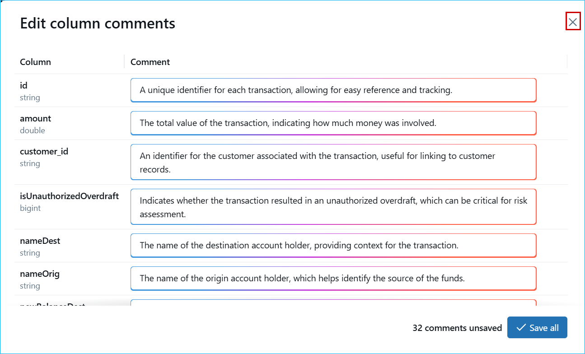

## Exercise 1: Lakehouse Setup & Data Orchestration with Azure Databricks and Lakeflow declarative pipelines

In this exercise, you will build a Lakehouse environment using Azure Databricks and Lakeflow to orchestrate and transform data. You’ll load data into Unity Catalog, create ETL pipelines, and explore AI-driven insights, lineage, and profiling.

### Task 1.1: Set Up Azure Databricks Environment and load data into Unity Catalog

1. Click the following link to open the Databricks workspace: **https://adb-689745566023860.0.azuredatabricks.net**

2. On the Databricks workspace page, select the **Catalog**, click on **zava_unity_catalog**, and then choose **schema-1957817**.

   

3. From the left navigation, select **Workspace**, expand Workspace **Repos**, choose **Analytics with ADB**, and open **01.1-DLT-fraud-detection-SQL**.

    

4. Explore the notebook review the code cells, markdown explanations, and outputs to understand the workflow and logic.

    

### Task 1.2: Create ETL pipeline for Data Transformation

1. From the left navigation pane, select **Jobs & Pipelines**, then choose **ETL Pipeline**.

   

2. View the ETL pipeline explore the pipeline and review the **pipeline graph** to understand the data flow and transformation process.

   

### Task 1.3: Generate column-level insights with AI Suggested Descriptions, then explore data lineage, table update history, and profiling in Azure Databricks.

1. Navigate to the tables you created under your schema **schema-1957817** in the Databricks workspace, and click on **AI Generate** to automatically generate comments for the table columns.

> Note: If a pop-up appears with the message **Saving comments in bulk could be slow**, click Continue.

2. Review the AI-generated comments for the columns, then click on **close** and in Unsaved Changes select Discard changes.

   

3. To view the lineage, select the **Lineage** tab and review the details in that section. Additionally, click on **See Lineage Graph** to view a visual representation of the data flow.

 

