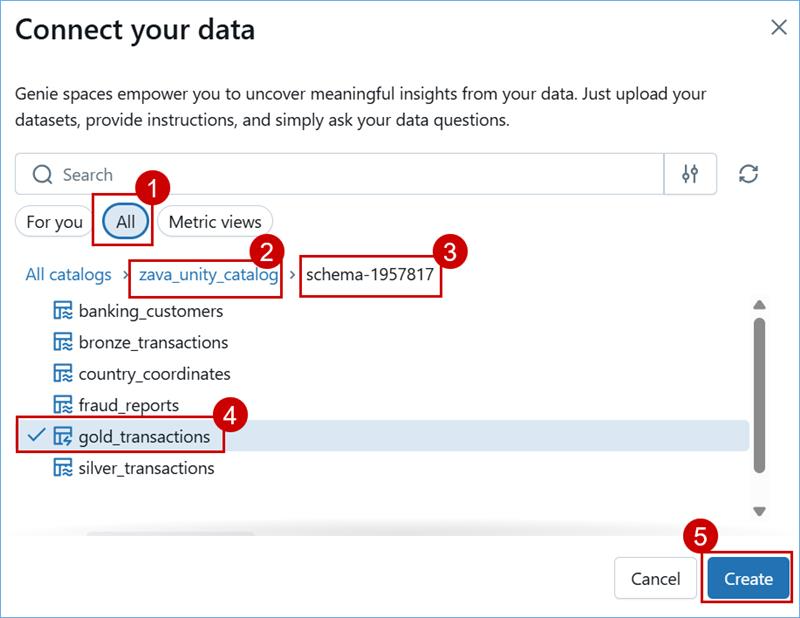
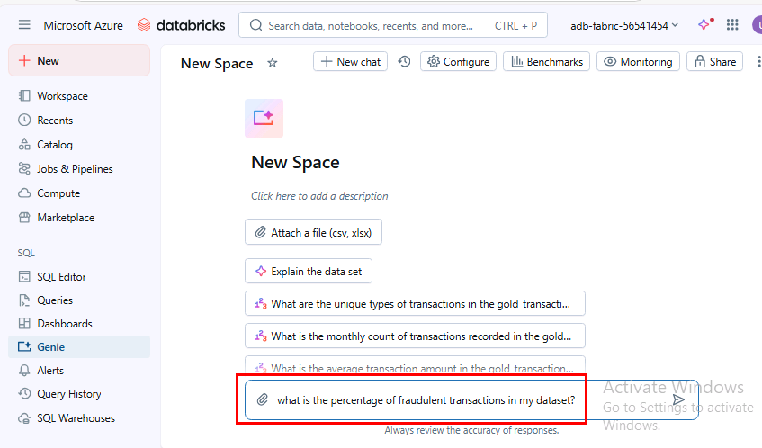
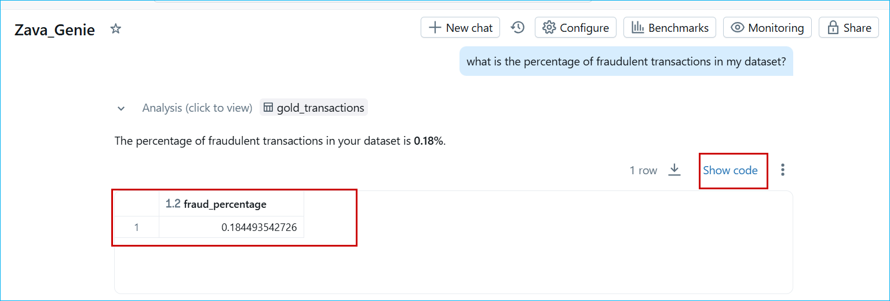
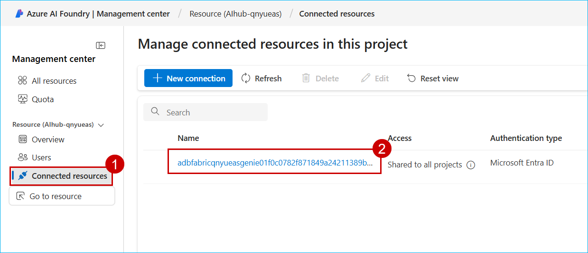
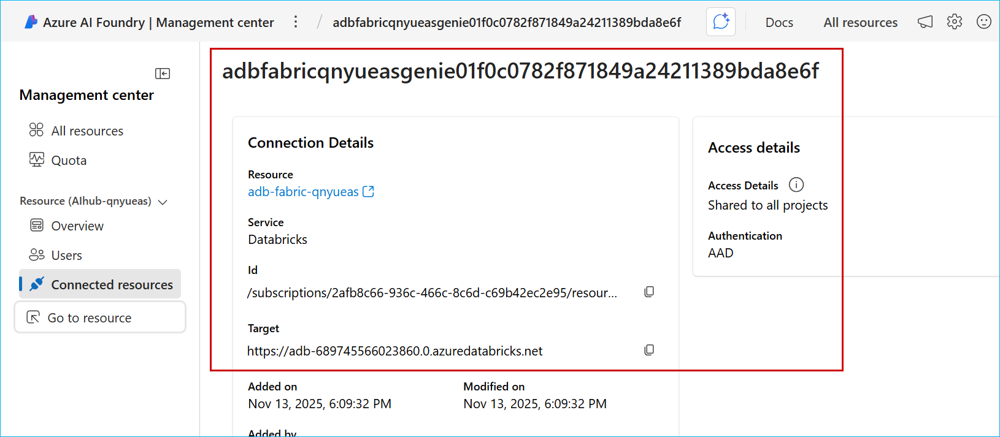

## Exercise 2: AI-Driven Insights with Azure AI Foundry & Genie

In this exercise, you will integrate Azure Databricks Genie with Azure AI Foundry to enable AI-driven insights and natural language interaction with your data. You’ll create a Genie assistant to analyze transactions and detect fraud patterns, connect it to AI Foundry for seamless orchestration, and finally use the AI agent within a custom web application to deliver interactive, data-powered intelligence.

### Task 2.1: Create a Databricks Assistant AI/BI Genie

 In this Task You’ll create a Genie assistant to analyze transactions and detect fraud patterns

1. In the left menu bar, click on **Genie**.


2. Click on **+ New**.


3. Click on **All** and then click on **zava_unity_catalog**.

4. Click on the **schema-1957817** you created.

5. Select **gold_transactions**, then click on **Create**.



6. Click on **New Space** in the top left to edit the name and replace it with **Zava_Genie**.


7. Paste the following question in chat box and click on send.

   ```
   what is the percentage of fraudulent transactions in my dataset?
   ```




8. Observe the response from Genie, then click **Show code** to view the code Genie used to formulate the answer.

   > **Note**: The responses from Genie may not match the ones in the screenshot but will provide a similar response.

    


### Task 2.2: Connect AI/BI Genie inside AI Foundry.

In this Task You’ll connect AI/BI Genie to AI Foundry for seamless orchestration

1. Click on the following link to open the **Microsoft Foundry portal**: [Microsoft Foundry link](https://ai.azure.com/foundryResource/overview?wsid=/subscriptions/2afb8c66-936c-466c-8c6d-c69b42ec2e95/resourceGroups/rg-ignite-25-qnyueas/providers/Microsoft.CognitiveServices/accounts/AIhub-qnyueas&tid=f94768c8-8714-4abe-8e2d-37a64b18216a)

2. Scroll down and then click on **Management center**.

   

3. Click on **Connected resources** then open the existing connection.

   

4. View the connection details then close the connection window.

   

### Task 2.3: Use Agent Created Inside AI Foundry with Custom Web App

In this Task, You'll use the AI agent within a custom web application to deliver interactive, data-powered intelligence.


1. Open the webapp **https://app-aifoundry-genieintegration.azurewebsites.net/#/landing-page**

2. Select the terms and conditions checkbox, then click Login.

3. Click on the robot icon located at the bottom-right corner of the page.

   

4. Click on the first pre-populated question.

   

5. Observe the response.

   

6. Click on the second pre-populated question and observe the response.

   

7. Click on the third pre-populated question and observe the response.

   

8. Click on the next pre-populated question and observe the response.

   

