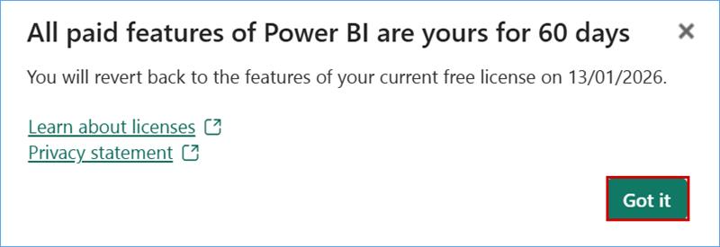
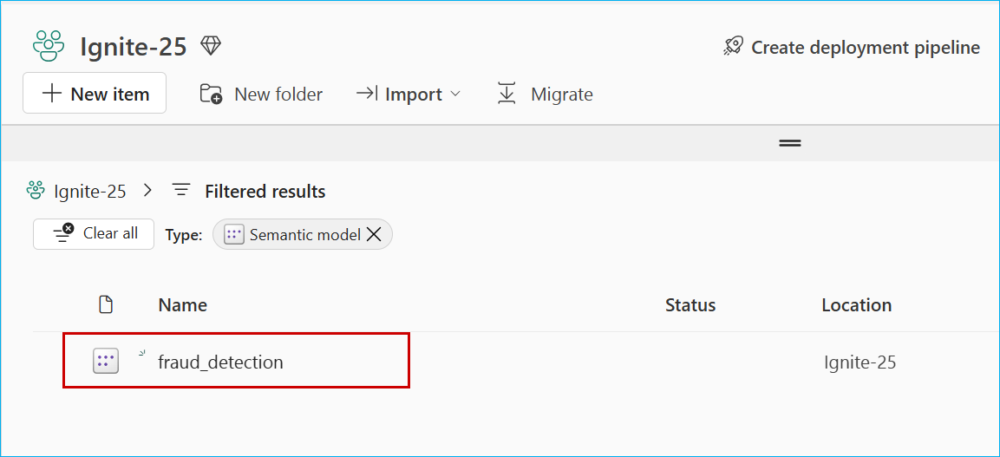

## Exercise 3: Azure Databricks Mirrored Catalog in Microsoft Fabric

In this exercise, you will integrate Azure Databricks Unity Catalog with Microsoft Fabric’s OneLake using the Mirrored Catalog feature. This enables real-time access to Databricks data in Fabric without duplication. You’ll then create a semantic model in Direct Lake mode and use Power BI with Copilot to visualize, explore, and generate actionable insights on fraudulent transactions.

### Task 3.1: Mirror Unity Catalog Table into Fabric’s OneLake

Mirroring the Azure Databricks Catalog structure in Fabric allows seamless access to the underlying catalog data through shortcuts. This means that any changes made to the data are instantly reflected in Fabric, without the need for data movement or replication. Let’s step into Data Engineer, Eva’s shoes to create a Mirrored Azure Databricks Catalog and analyze the data using T-SQL. 

1. Navigate to the Microsoft Fabric tab on your browser (https://app.fabric.microsoft.com).

2. When it pops up asking to **upgrade the Power BI license**, click **Try free**.


3. click on **Got it**.



4. Click on the **Ignite-25** and select **New item** from menu bar.


5. In the **New item** window, scroll down and click on **Microsoft Azure Databricks catalog**.


6. When the **New source** window pops up, click on the **Create new connection** radio button.


7. In the URL field enter **<inject key="Databricks2" />**

8. Now, select **Service principal** from 'Authentication kind' dropdown box, and enter the following details.

- Tenant ID: <inject key="Tenant ID" />
- Service principal client ID: <inject key="Service principal client ID" />
- Service principal Key: <inject key="Service principal Key" />

9. click on the **Connect** button.


10. Click on **Next** button.


11. In the Choose data screen, select the Catalog name as **zava_unity_catalog** from the dropdown box, and select the **fraud-detection** schema if not selected, scroll down then select the checkbox **Automatically sync future catalog changes for the selected schema** (to mirror future tables) if not ticked and click on **Next** button.


12. Enter Name as zava_unity_catalog_<inject key= "DeploymentID" enableCopy="false"/> and click on the **Create** button.

 

13. Click on the **Monitor catalog** button to track the mirroring status and then close it.


14. Click on the **View SQL endpoint** button. You can also select the tables to preview data.


### Task 3.2: Create a semantic model in Direct Lake mode and use Power BI to visualize and generate 

1. Select **Ignite-25** workspace from left navigation pane.

   

2. Click on the filter option in the top-right corner then select the semantic model.

   

3. Observe the pre-created semantic model named **fraud_detection**, which is built on top of the gold transaction table.

   

4. Click on the Ellipses (3 dots) next to **fraud_detection** Semantic Model to load the dropdown menu. Select **Create report** from the dropdown.

   

5. Click on the **Copilot** button, select the ‘Inspire’ button (The Glitter icon at the bottom left of the chat window). Select the option **What’s in my data?** under the Inspire pane.

   

6. Paste the following question into the Copilot chat and take a look at the response.

```
Create a report to analyse in detail only fraudulent transactions.
```


7. Paste the following question into the Copilot chat and take a look at the response.
```
Based on the data of this report, what can be done to reduce the fraudulent transactions, and should I focus on.
```


