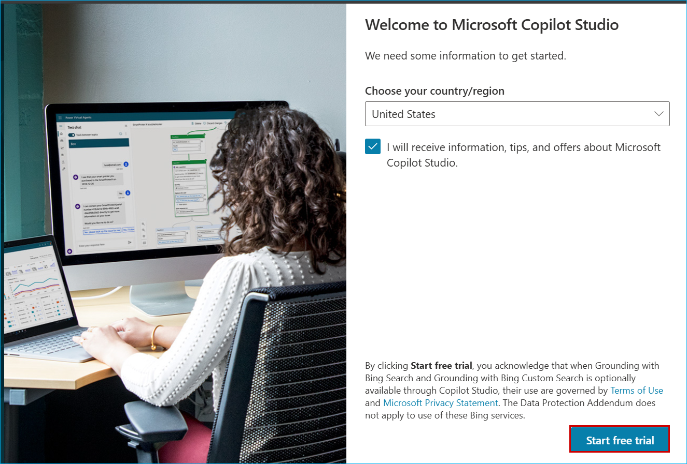
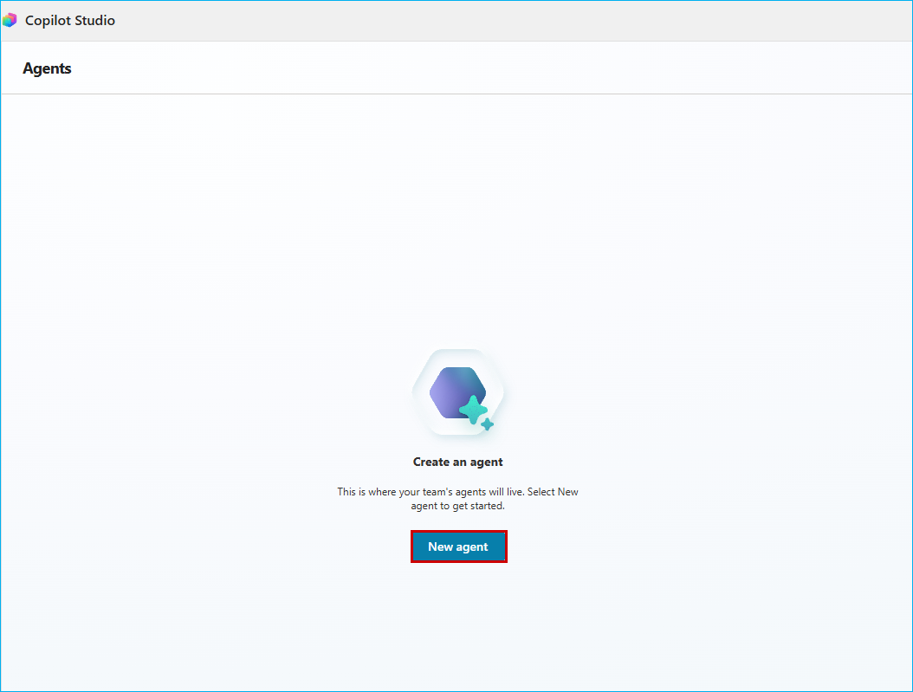
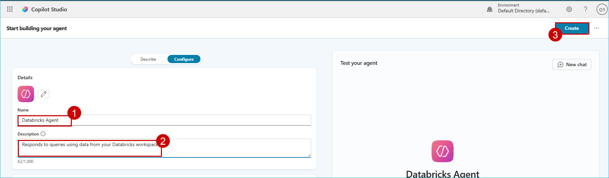
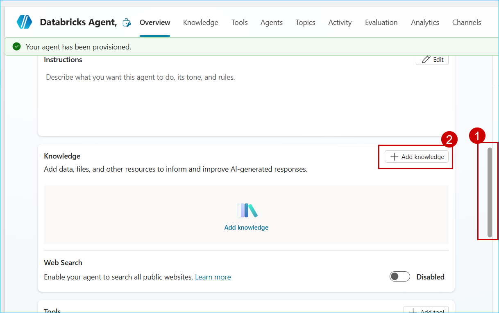
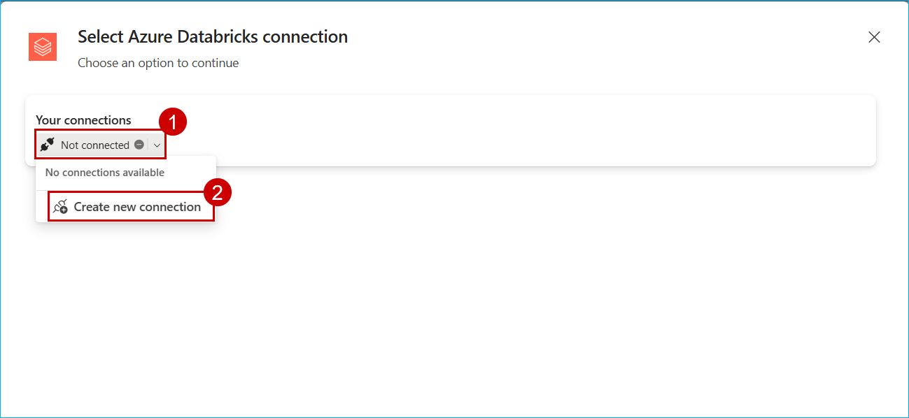
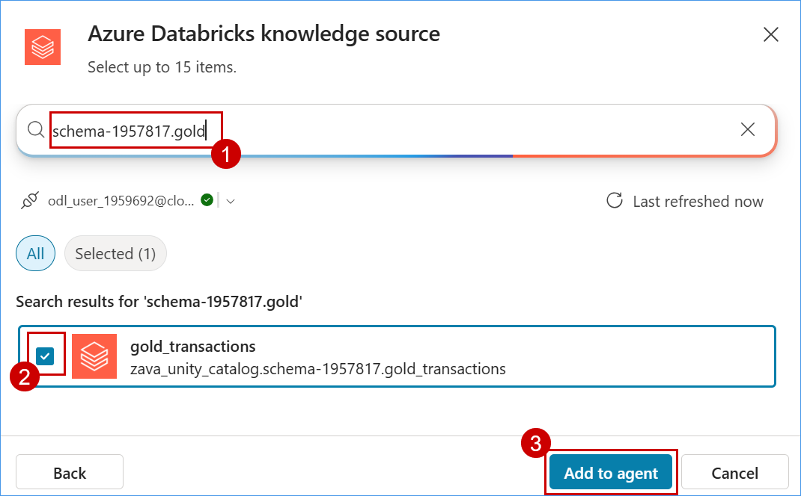
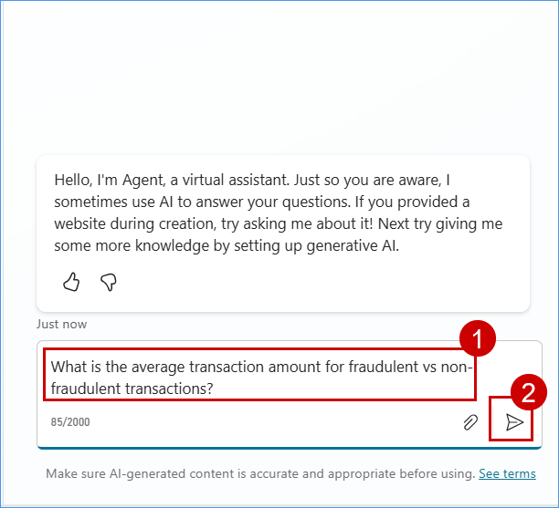
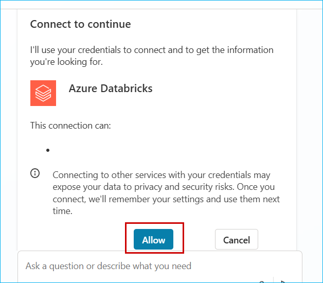
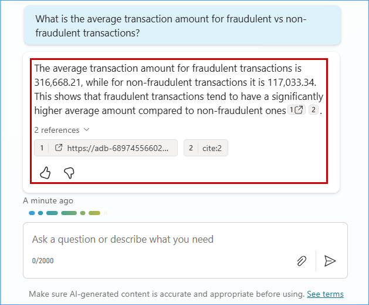

## Exercise 4: Copilot Studio for Low-Code  (Optional)

In this exercise, you will use Microsoft Copilot Studio to build a low-code AI agent that connects to Azure Databricks as its knowledge source. The agent will answer business-related questions using live Databricks data. You’ll then publish the agent to Microsoft Teams, enabling users to interact with Databricks data seamlessly through natural language conversations.

### Task 4.1: Create an agent and connect Azure Databricks as its knowledge source to support Business Q&A.

1. Go to **[Copilot Studio](https://copilotstudio.microsoft.com/)**,  In the Welcome to Microsoft Copilot Studio page, select **Start free trial** and Proceed.

> Note : If you encounter the message Something went wrong. We were unable to load your agents, please retry, Refresh the page again.



2. select **Agents** from the left menu, and click **New agent**.

 

> Note: Wait for page to load and refresh the page

3. Enter the following values in the respective fields and then click **Create**.

 **Agent name** : 
 ```
 Databricks Agent
 ```

**Description** : 
```
Responds to queries using data from your Databricks workspace.
```



4. On the **Databricks Agent** page, scroll down and click **+ Add knowledge** to include a knowledge source.



6. On the **Add knowledge** page, click **Advanced**, then select **Azure Databricks**.


7. On the Select **Azure Databricks connection** pane, click on **Not connected** dropdown and select **Create new connection**.

 

8. In the Server Hostname field type: **adb-689745566023860.0.azuredatabricks.net**

```
adb-689745566023860.0.azuredatabricks.net
```

9. In the HTTP path field type: **/sql/1.0/warehouses/30423e4b958bb27b** and click on **Create**.

```
/sql/1.0/warehouses/30423e4b958bb27b
```


10. In the pop-up window, select your account and click **Sign in**.


11. Select **zava_unity_catalog** and click **Select**.


12. Search for **schema-1957817.gold** then select the **gold_transactions** tables within it, and click **Add to Agent**.



13. Paste the following question to **Test your agent**.

```
What is the average transaction amount for fraudulent vs non-fraudulent transactions?
```



14. If a prompt appears asking for permission to connect in order to continue, please click **Allow**.




15. Observe the response from Agent.



> **Note:** The agent may not respond initially after adding a new data source. **Re-enter** the question or start a **+ New test session** to get a response.

### Task 4.2: Publish the agent in Microsoft Teams channels and make it accessible to users.

1. Click on **Channels**, then click on **Microsoft Channels**.


2. Navigate to following url to see the agent in action : [Click by click](https://click-by-click.azurewebsites.net/#preview/mhw2w6exgz21zno97ch)

Congratulations! As Data Engineers and Data Analysts, you have empowered Zava to transform its disparate data sources into actionable insights-driving growth, enhancing customer satisfaction, and securing a competitive edge.

## Feedback

Your feedback is very useful to us and helps us improve our labs for future events. Please click on the link below for a short survey.

[LAB 535 Feedback](https://aka.ms/ignite25-feedback)

