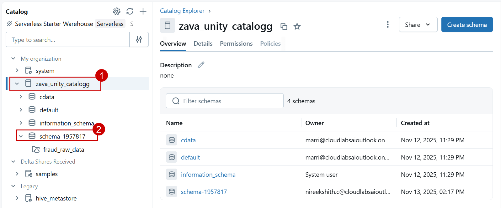
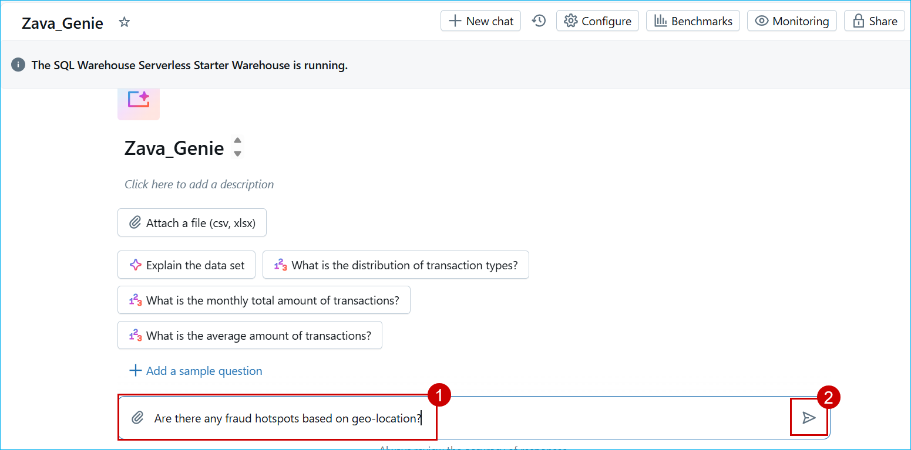
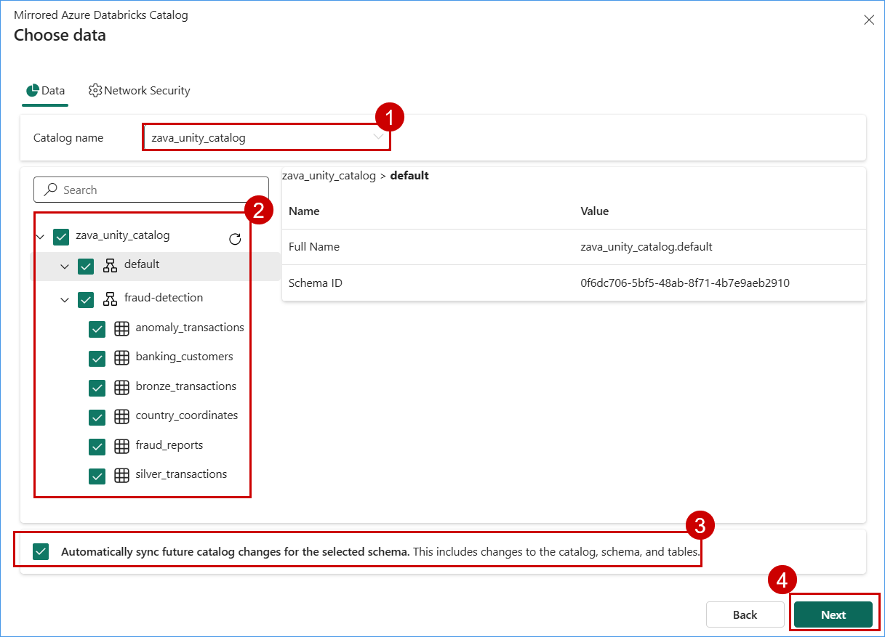
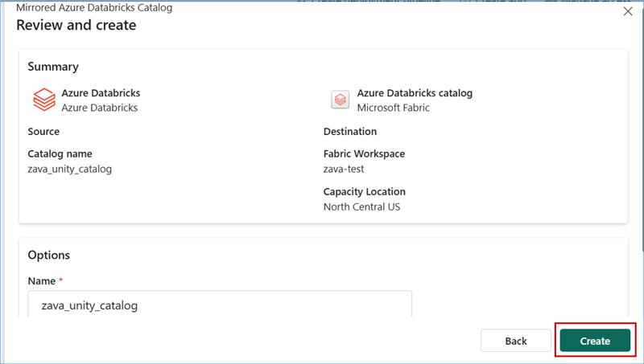
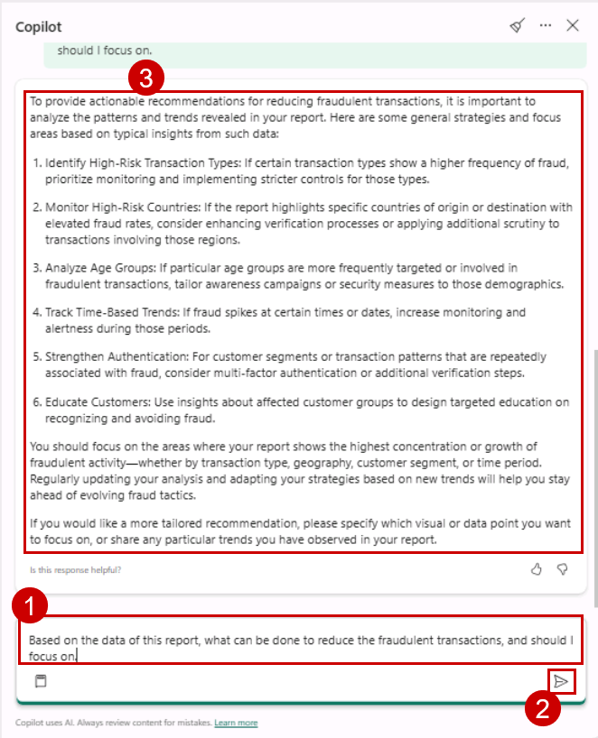
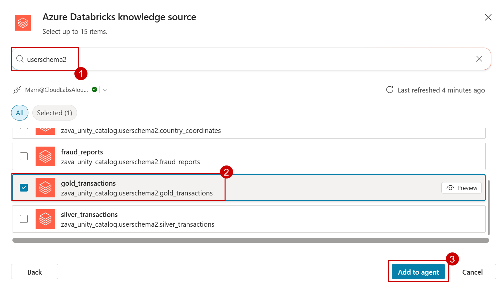

# Ignite25-LAB335-analytics-and-ai-with-azure-databricks-ai-foundry-and-copilot
**The estimated time to complete this lab is 50-60 minutes.**

Azure Databricks in Action: Unified Al & Analytics Across Microsoft
The estimated time to complete this lab is 50-60 minutes.

DISCLAIMER

This presentation, demonstration, and demonstration model are for informational purposes only and (1) are not subject to SOC 1 and SOC 2 compliance audits, and (2) are not designed, intended or made available as a medical device(s) or as a substitute for professional medical advice, diagnosis, treatment or judgment. Microsoft makes no warranties, express or implied, in this presentation, demonstration, and demonstration model. Nothing in this presentation, demonstration, or demonstration model modifies any of the terms and conditions of Microsoft's written and signed agreements. This is not an offer and applicable terms and the information provided are subject to revision and may be changed at any time by Microsoft.

This presentation, demonstration, and demonstration model do not give you or your organization any license to any patents, trademarks, copyrights, or other intellectual property covering the subject matter in this presentation, demonstration, and demonstration model.

The information contained in this presentation, demonstration and demonstration model represents the current view of Microsoft on the issues discussed as of the date of presentation and/or demonstration, for the duration of your access to the demonstration model. Because Microsoft must respond to changing market conditions, it should not be interpreted to be a commitment on the part of Microsoft, and Microsoft cannot guarantee the accuracy of any information presented after the date of presentation and/or demonstration and for the duration of your access to the demonstration model.

No Microsoft technology, nor any of its component technologies, including the demonstration model, is intended or made available as a substitute for the professional advice, opinion, or judgment of (1) a certified financial services professional, or (2) a certified medical professional. Partners or customers are responsible for ensuring the regulatory compliance of any solution they build using Microsoft technologies.

Copyright

© 2024 Microsoft Corporation. All rights reserved. 

By using this demo/lab, you agree to the following terms:

The technology/functionality described in this demo/lab is provided by Microsoft Corporation for purposes of obtaining your feedback and to provide you with a learning experience. You may only use the demo/lab to evaluate such technology features and functionality and provide feedback to Microsoft. You may not use it for any other purpose. You may not modify, copy, distribute, transmit, display, perform, reproduce, publish, license, create derivative works from, transfer, or sell this demo/lab or any portion thereof.

COPYING OR REPRODUCTION OF THE DEMO/LAB (OR ANY PORTION OF IT) TO ANY OTHER SERVER OR LOCATION FOR FURTHER REPRODUCTION OR REDISTRIBUTION IS EXPRESSLY PROHIBITED.

THIS DEMO/LAB PROVIDES CERTAIN SOFTWARE TECHNOLOGY/PRODUCT FEATURES AND FUNCTIONALITY, INCLUDING POTENTIAL NEW FEATURES AND CONCEPTS, IN A SIMULATED ENVIRONMENT WITHOUT COMPLEX SET-UP OR INSTALLATION FOR THE PURPOSE DESCRIBED ABOVE. THE TECHNOLOGY/CONCEPTS REPRESENTED IN THIS DEMO/LAB MAY NOT REPRESENT FULL FEATURE FUNCTIONALITY AND MAY NOT WORK THE WAY A FINAL VERSION MAY WORK. WE ALSO MAY NOT RELEASE A FINAL VERSION OF SUCH FEATURES OR CONCEPTS. YOUR EXPERIENCE WITH USING SUCH FEATURES AND FUNCITONALITY IN A PHYSICAL ENVIRONMENT MAY ALSO BE DIFFERENT

## Overview


This lab showcases how Azure Databricks, Microsoft Fabric, Copilot Studio, and Azure AI Foundry work together to deliver a cost-effective, performance-optimized, cloud-native analytics solution pattern. he architecture unifies the enterprise data estate, enabling organizations to accelerate data value creation and unlock actionable insights with Microsoft's latest innovations: Azure Databricks, Microsoft Fabric, Azure AI Foundry, and Copilot Studio.

In today's data-driven world, organizations need solutions that seamlessly integrate analytics and AI to deliver actionable insights at scale. This hands-on lab will guide you through building a modern, cloud-native analytics and AI architecture using Microsoft's latest innovations: Azure Databricks, Microsoft Fabric, Azure AI Foundry, and Copilot Studio. You'll work through a real-world scenario featuring Zava, a global retailer acquiring Litware Inc., which introduces a rich set of curated marketing and sales data. This data is processed in Azure Databricks and stored in the gold layer of ADLS, forming the foundation for advanced analytics and AI-driven decision-making. Throughout the lab, you will:

Set up a Lakehouse architecture with Azure Databricks and orchestrate data pipelines using Lakeflow declarative pipelines.
Transform and enrich data with ETL processes, explore data lineage, and leverage AI-powered column-level insights.
Build AI-driven experiences using Genie and Azure AI Foundry, enabling conversational analytics and business Q&A.
Mirror Unity Catalog tables into Microsoft Fabric's OneLake, create semantic models in Direct Lake mode, and visualize insights in Power BI.
Develop low-code automation with Copilot Studio, creating conversational agents that integrate with Teams and respond to business queries like "What's the top-selling product this week?"
By the end of this immersive session, you'll have implemented a scalable, cost-effective, and performance-optimized solution that demonstrates how AI-powered analytics can reshape business outcomes-from data ingestion to intelligent insights and automation.

## Table of Contents

### Exercise 1: Lakehouse Setup & Data Orchestration with Azure Databricks and Lakeflow declarative pipelines

- Task 1: Set Up Azure Databricks Environment and load data into Unity Catalog

- Task 2: Create ETL pipeline for Data Transformation

- Task 3: Generate column-level insights with AI Suggested Descriptions, then explore data lineage, table update history, and profiling in Azure Databricks.

### Exercise 2: AI-Driven Insights with Azure AI Foundry & Genie

- Task 2.1: Create a Databricks Assistant AI/BI Genie

  - Design an assistant that can respond to business queries using curated datasets

- Task 2.2: Connect AI/BI Genie inside AI Foundry.

  - Use Azure AI Foundry to create a connection to Databricks AI/BI Genie using the native connector

- Task 2.3: Use Agent Created Inside AI Foundry with Custom Web App

  - Chat with you data in an custom webapplication

### Exercise 3: Azure Databricks Mirrored Catalog in Microsoft Fabric

- Task 3.1: Mirror Unity Catalog Table into Fabric's OneLake
  - Setup: Create Microsoft Fabric Workspace
  - Create Fabric's mirrored catalog in Fabric

- Task 3.2: Create a semantic model in Direct Lake mode and use Power BI to visualize and generate insights

### Exercise 4: Copilot Studio for Low-Code Automation

- Task 4.1: Create an agent and connect Azure Databricks as its knowledge source to support Business Q&A.

  - Build a conversational agent using Copilot Studio Train it to answer questions like "What's the top-selling product this week?"

- Task 4.2: Publish the agent in Microsoft Teams channels and make it accessible to users.
Test and refine bot responses for accuracy and relevance


## Exercise 1: Lakehouse Setup & Data Orchestration with Azure Databricks and Lakeflow declarative pipelines

In this exercise, you will build a Lakehouse environment using Azure Databricks and Lakeflow to orchestrate and transform data. You’ll load data into Unity Catalog, create ETL pipelines, and explore AI-driven insights, lineage, and profiling.

### Task 1.1: Set Up Azure Databricks Environment and load data into Unity Catalog

1. Click the following link to open the Databricks workspace: **https://adb-486601822035519.19.azuredatabricks.net**

2. On the Databricks workspace page, select the **Catalog**, click on **zava_unity_catalog**, and then choose **schema-1957817**.

   

3. From the left navigation, select **Workspace**, expand Workspace **Repos**, choose **Analytics with ADB**, and open **01.1-DLT-fraud-detection-SQL**.

    

4. Explore the notebook review the code cells, markdown explanations, and outputs to understand the workflow and logic.

    

### Task 1.2: Create ETL pipeline for Data Transformation

1. From the left navigation pane, select **Jobs & Pipelines**, then choose **ETL Pipeline**.

   

2. View the ETL pipeline explore the pipeline and review the **pipeline graph** to understand the data flow and transformation process.

   


### Task 1.3: Generate column-level insights with AI Suggested Descriptions, then explore data lineage, table update history, and profiling in Azure Databricks.

1. Navigate to the tables you created under your schema in the Databricks workspace, and click on **AI Generate** to automatically generate comments for the table columns.


2. Review the AI-generated comments for the columns, then click **Save All** to apply the changes.

   

3. To view the lineage, select the **Lineage** tab and review the details in that section. Additionally, click on **See Lineage Graph** to view a visual representation of the data flow.

 

4. Select the **History** tab to view the update history of the table.

 


## Exercise 2: AI-Driven Insights with Azure AI Foundry & Genie

In this exercise, you will integrate Azure Databricks Genie with Azure AI Foundry to enable AI-driven insights and natural language interaction with your data. You’ll create a Genie assistant to analyze transactions and detect fraud patterns, connect it to AI Foundry for seamless orchestration, and finally use the AI agent within a custom web application to deliver interactive, data-powered intelligence.

### Task 2.1: Create a Databricks Assistant AI/BI Genie

 In this Task You’ll create a Genie assistant to analyze transactions and detect fraud patterns

1. In the left menu bar, click on **Genie**.


2. Click on **+ New**.


3. Click on **All** and then click on **zava_unity_catalog**.

4. Click on the **schema-1957817** you created.

5. Select **gold_transactions**, then click on **Create**.


6. Click on **New Space** in the top left to edit the name and replace it with **Zava_Genie**.


7. Paste the following question in chat box and click on send.

   ```
   Are there any fraud hotspots based on geo-location?
   ```


    

8. Observe the response from Genie, then click **Show code** to view the code Genie used to formulate the answer.

   > **Note**: The responses from Genie may not match the ones in the screenshot but will provide a similar response.

    


### Task 2.2: Connect AI/BI Genie inside AI Foundry.

In this Task You’ll connect AI/BI Genie to AI Foundry for seamless orchestration

1. Click on the following link to open the **AI Foundry portal**: [AI Foundry link](https://ai.azure.com/foundryResource/overview?wsid=/subscriptions/2afb8c66-936c-466c-8c6d-c69b42ec2e95/resourceGroups/rg-ignite-25-qnyueas/providers/Microsoft.CognitiveServices/accounts/AIhub-qnyueas&tid=f94768c8-8714-4abe-8e2d-37a64b18216a)

2. Scroll down and then click on **Management center**.

   

3. Click on **Connected resources**, then click on **+ New connection**.

   

4. Scroll down and click on **Azure Databricks**.

   

5. Click the dropdown for **Connection Type**, then Select **Genie**.

   >**Note**: Please make sure you select the **Resource group** you opened in **step 1**.

    

7. Click the drop down for **Select Genie space**, choose **Zava_genie**, and then click on **Add connection**.

   

8. Once it's **Connected**, Click on **close**.

   

### Task 2.3: Use Agent Created Inside AI Foundry with Custom Web App

In this Task, You'll use the AI agent within a custom web application to deliver interactive, data-powered intelligence.


1. Open the webapp **https://app-aifoundry-genieintegration.azurewebsites.net/#/landing-page**

2. Click on the robot icon located at the bottom-right corner of the page.

   

3. Click on the first pre-populated question.

   

4. Observe the response.

   

5. Click on the second pre-populated question and observe the response.

   

6. Click on the third pre-populated question and observe the response.

   

7. Click on the next pre-populated question and observe the response.

   


## Exercise 3: Azure Databricks Mirrored Catalog in Microsoft Fabric

In this exercise, you will integrate Azure Databricks Unity Catalog with Microsoft Fabric’s OneLake using the Mirrored Catalog feature. This enables real-time access to Databricks data in Fabric without duplication. You’ll then create a semantic model in Direct Lake mode and use Power BI with Copilot to visualize, explore, and generate actionable insights on fraudulent transactions.

### Task 3.1: Mirror Unity Catalog Table into Fabric’s OneLake

Mirroring the Azure Databricks Catalog structure in Fabric allows seamless access to the underlying catalog data through shortcuts. This means that any changes made to the data are instantly reflected in Fabric, without the need for data movement or replication. Let’s step into Data Engineer, Eva’s shoes to create a Mirrored Azure Databricks Catalog and analyze the data using T-SQL. 

1. Navigate back to the Microsoft Fabric tab on your browser (https://app.fabric.microsoft.com).

2. Click on the **Ignite-25** and select **New item** from menu bar.


3. In the **New item** window, scroll down and click on **Microsoft Azure Databricks catalog (preview)**.


4. When the **New source** window pops up, click on the **Create new connection** radio button.


5. In the URL field enter **https://adb-486601822035519.19.azuredatabricks.net**

6. Now, select **Service principal** from 'Authentication kind' dropdown box, and enter the following details.

- Tenant ID: ```f94768c8-8714-4abe-8e2d-37a64b18216a```
- Service principal client ID: ```95121828-71fb-4854-a9e6-cb7294eff8a2```
- Service principal Key: 

7. click on the **Connect** button.


8. Click on **Next** button.


9. In the Choose data screen, select the Catalog name as **zava_unity_catalog** from the dropdown box, and select the **fraud-detection** schema if not selected, scroll down then select the checkbox **Automatically sync future catalog changes for the selected schema** (to mirror future tables) if not ticked and click on **Next** button.



10. Enter the **Name** for your mirrored Databricks Catalog and click on the **Create** button.



11. Click on the **Monitor catalog** button to track the mirroring status and then close it.


12. Click on the **View SQL endpoint** button. You can also select the tables to preview data.


### Task 3.2: Create a semantic model in Direct Lake mode and use Power BI to visualize and generate insights

1. Click on **New Semantic model**.


2. Paste the semantic model name as **fraud_detection**, expand tables and select **anomaly_transactions** and then click on Confirm.


3. Click on the Ellipses (3 dots) next to **fraud_detection** Semantic Model to load the dropdown menu. Select **Create report** from the dropdown.


4. Click on the **Copilot** button, select the ‘Inspire’ button (The Glitter icon at the bottom left of the chat window). Select the option **What’s in my data?** under the Inspire pane.


5. Paste the following question into the Copilot chat and take a look at the response.

```
Create a report to analyse in detail only fraudulent transactions.
```


6. Paste the following question into the Copilot chat and take a look at the response.
```
Based on the data of this report, what can be done to reduce the fraudulent transactions, and should I focus on.
```


7. Paste the following question into the Copilot chat and take a look at the response.

```
What fraud prevention efforts can be implemented in each country with the highest number of fraud transactions?
```


## Exercise 4: Copilot Studio for Low-Code Automation

In this exercise, you will use Microsoft Copilot Studio to build a low-code AI agent that connects to Azure Databricks as its knowledge source. The agent will answer business-related questions using live Databricks data. You’ll then publish the agent to Microsoft Teams, enabling users to interact with Databricks data seamlessly through natural language conversations.

### Task 4.1: Create an agent and connect Azure Databricks as its knowledge source to support Business Q&A.

1. Go to **[Copilot Studio](https://copilotstudio.microsoft.com/)**, select **Agents** from the left menu, and click **+ New agent**.


2. On the welcome screen for Microsoft Copilot Studio, Click on the Get Started button to proceed.

3. On the **Start building your agent** page, click **Configure**, enter the agent name as **Databricks Agent**, add the description **Responds to queries using data from your Databricks workspace**, and then click **Create**.


4. On the **Databricks Agent** page, click **+ Add knowledge** to include a knowledge source.


5. On the **Add knowledge** page, click **Advanced**, then select **Azure Databricks**.


6. In the Server Hostname field type: **adb-689745566023860.0.azuredatabricks.net**

7. In the HTTP path field type: **/sql/1.0/warehouses/30423e4b958bb27b** and click on **Create**.


9. In the pop-up window, select your account and click **Sign in**.


10. Select **zava_unity_catalog** and click **Select**.


11. Search for your schema, select the **gold_transactions** tables within it, and click **Add to Agent**.



12. Paste the following question to **Test your agent**.

```
Are there any fraud hotspots based on geo-location?
```


13. The Agent will respond with:
 **Let's get you connected first, and then I can find that info for you. ​Open connection manager​ to verify your credentials.**
 Click on **​Open connection manager**.


>**Note**:  If prompted to sign in, use your user ID to complete the sign-in process.


14. Click on **Connect**.


15. Click on **Submit**.


16. Navigate back to the **Agent** page and Paste the same question again into **Test your agent**.

```
Are there any fraud hotspots based on geo-location?
```


### Task 4.2: Publish the agent in Microsoft Teams channels and make it accessible to users.

1. Click on **Channels**, then click on **Microsoft Channels**.


2. Navigate to following url to see the agent in action : [Click by click](https://click-by-click.azurewebsites.net/#preview/mhw2w6exgz21zno97ch)


