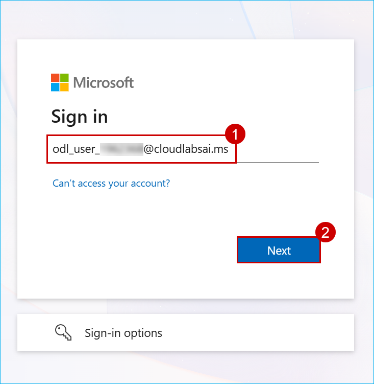
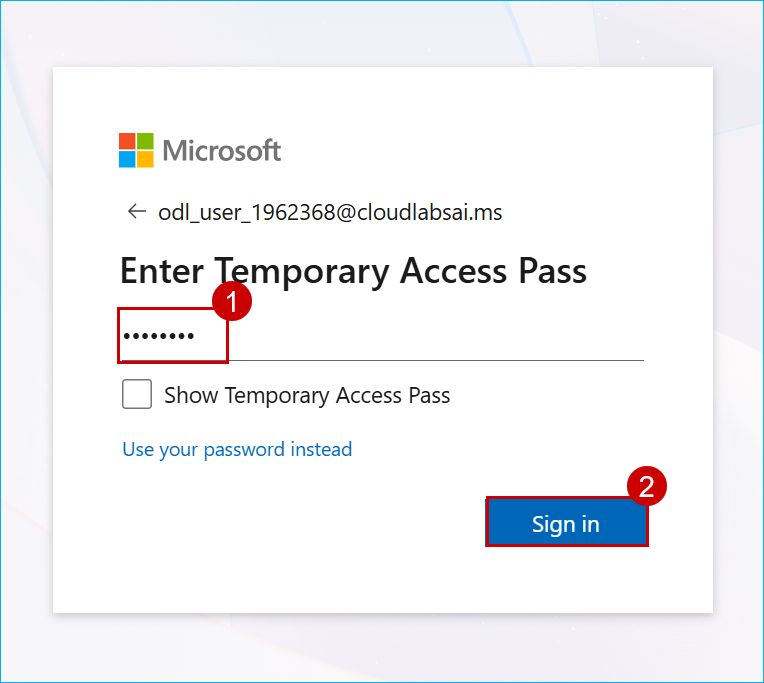
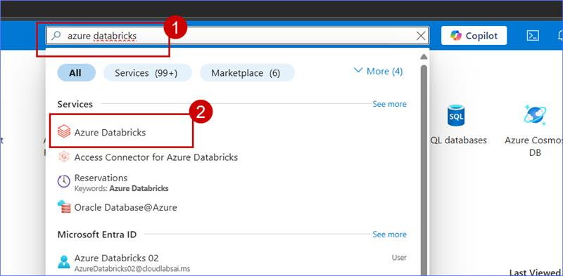
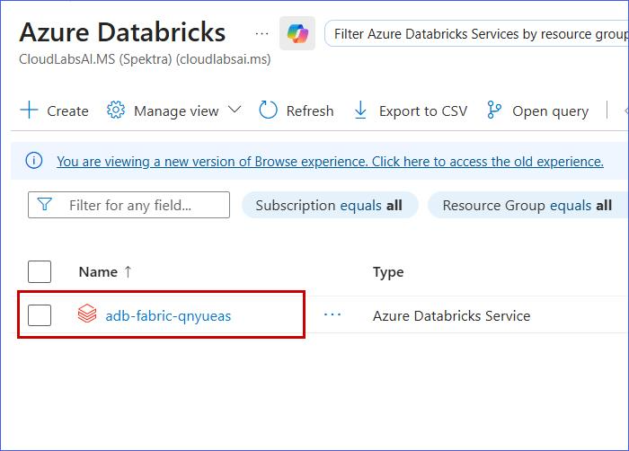
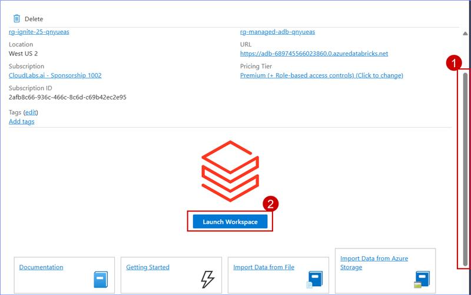
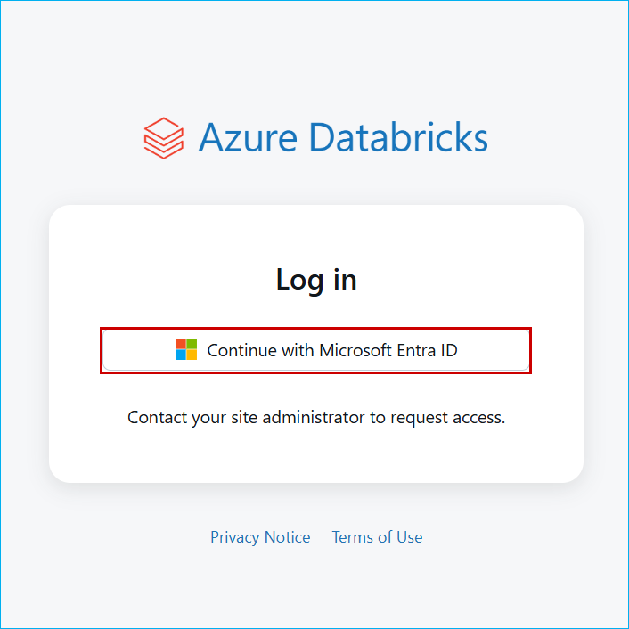

<!-- Auth Table -->

| **User Login Credentials** |                                       |
|-----------------|---------------------------------------|
| Username    | <inject key="AzureAdUserEmail" />     |
| Password   | <inject key="AzureAdUserPassword" />  |

<!-- Resource Details Table -->
<table>
  <thead>
    <tr>
      <th>Resources</th>
      <th>Links</th>
    </tr>
  </thead>
  <tbody>
    <tr>
    <td>Azure Databricks</td>
    <td>
        <a href="https://adb-486601822035519.19.azuredatabricks.net/" target="_blank">
          https://adb-486601822035519.19.azuredatabricks.net/
        </a>
    </td>
    </tr>
    <tr>
    <td>Microsoft Fabric Workspace</td>
    <td>
        <a href="https://app.fabric.microsoft.com/home" target="_blank">
          https://app.fabric.microsoft.com/home
        </a>
    </td>
    </tr>
  </tbody>
</table>

## Getting Started with Lab

1. Open an InPrivate browsing window and paste the CloudLabs link.

2. In the new window, navigate to **https://portal.azure.com**.

3. On the Microsoft Azure browser tab, paste the provided Username:**<inject key="AzureAdUserEmail" />** to Sign in and click **Next** 

   

4. Now paste the following Password:**<inject key="AzureAdUserPassword" />** and click on Sign in.

   

5. Search for **Azure Databricks** and select it.

   

6. Click on the **adb-fabric-9msyp2f** from the result.

   

7. Scroll down and select **Launch Workspace** to open the Databricks workspace.

   

8. Click on **Continue with Microsoft Entra ID**.

   

   > **Note:** If you encounter any permission-related issues, please refresh the page 2-3 times. The page should load correctly afterward.

9. Now, click on Next from the lower right corner to move on to the next page.

   

